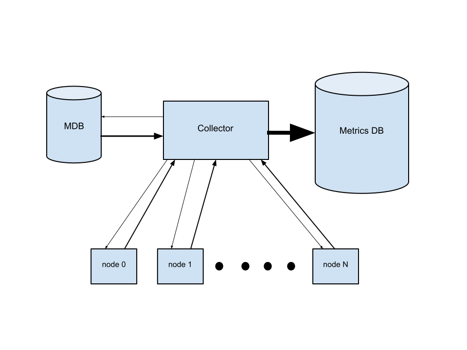
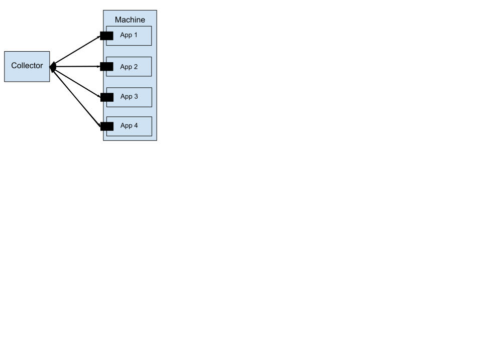

Lightweight Metrics Publishing and Collection
=============================================
Richard Gooch
-------------

Objective
=========

To define a simple protocol for publishing metrics which can be easily implemented and provide lightweight APIs for publishing metrics and a scalable, efficient and robust collector which pulls metrics from machines and can push to a variety of metrics processing and archiving systems. An additional objective is to support easy manual navigation and inspection of metrics on a target machine.

A key goal is to make metrics easily discoverable and accessible.

Non-Goals
---------

This design does not attempt to cover the collection of *logs*. The requirements for logs collection are quite different than metrics collection, and thus would require a solution better suited to those requirements. Notable differences between metrics and logs are:

-   the volume of metrics data is one to two orders of magnitude lower than the volume of logs data

-   metrics data may be freely published (within a company) as they do not contain sensitive data, it’s just performance and operational data about the system or application. Logs data contain sensitive information and thus require careful control over who has access

Design
======

Poll versus push
----------------

This design is a strict *polling* model, where applications (daemons) wishing to publish metrics simply expose them via TCP port and a central *collector* polls all the machines:port tuples of interest. The other common model for metrics publication is the *push* model, where applications push their metrics to a known collector. The *push* model has the following problems:

-   applications need to be configured so that they know where to push metrics to (i.e. the hostname of the collector)

-   it is prone to accidental Distributed Denial of Service (DDoS) attacks on the collector, leading to catastrophic failure, as the system falls over a performance cliff. Some collection systems provide a mechanism to tell the senders to “shut up”, but if the network interface on the collector is flooded with traffic, it can be difficult for the silencing commands to reach the senders

-   for systems where the senders buffer data in case of network problems or collector downtime, a transient network failure can trigger a DDoS flood even if the steady-state traffic is comfortably below the limits

-   DDoS floods are an emergency incident, requiring immediate resolution, otherwise large numbers of metrics will be lost

-   if multiple collectors are configured to share the load, a load-balancer is required, which introduces another point of failure and greater system complexity

-   moving a collector requires either pushing a configuration change to all the applications or changing a DNS entry. The latter approach makes a gradual redirection of traffic more difficult

The *poll* model does not suffer from these problems. Instead:

-   applications simply expose their metrics on a TCP port. Only the collector needs to be configured, which is much easier since it is a single system

-   since the collector initiates each poll, it is naturally rate-limited to its network bandwidth and processing capacity

-   as the number of machines or metrics increases, the collector gracefully degrades, increasing the time between polls. There is no performance cliff and thus no emergency response is required

-   due to the graceful degradation characteristics, the performance of the system can be monitored and used to automatically predict when the collection SLA will be at risk, leaving plenty of time to configure another collector to share the load

The following diagram shows the high-level architecture:

The arrows show the direction of network traffic, and their thickness shows the relative amount of traffic. The *poll* request from the collector to each of the applications is tiny, while the response containing the metrics data is considerably larger. The collector can push metrics to a database or other ingest system, without needing to change any application.

The following diagram shows the details for a single machine:

The Collector
-------------

The collector polls each application on the machine, if desired. Each application exposes its metrics via a network TCP port (more details below). This design also supports multiple collectors, with some collectors collecting from one set of applications and other collectors collecting from other applications. In practice, it is anticipated that a single collector will collect metrics from all applications for all machines, and extra collectors will only be added if the total rate of metrics to be collected exceeds the capacity of a single collector. The most natural way to distribute load across collectors is to divide the machines, but the design allows segmenting in various ways, such as segmenting across applications.

The collector will record collected metrics in a time-series database stored in local memory and local persistent storage. Current and historic metrics are made available via a REST/RPC interface, which supports building custom dashboards, ad-hoc fleet-wide queries and ingest to other metrics collection and aggregation systems downstream. It is anticipated that the collector can record several hours of metrics in local memory and a week of metrics in local storage. This is more than adequate buffer capacity in case of a temporary disconnect between the collector and downstream aggregators.

The collector can be configured to generate alerts and adjust its collection rate if its persistent store begins to fill up with metrics that have not been transferred to the upstream aggregation system. This allows for graceful degradation if the upstream aggregator cannot keep up.

Poll Everything
---------------

The collector polls *all* metrics that applications expose, rather than selectively polling some metrics. Stated another way: applications determine which metrics they wish to expose, but the collector will collect all the exposed metrics. While selectively polling may seem attractive because only the “interesting” metrics are collected and thus reducing network usage, this approach has the following disadvantages:

-   it increases the complexity of the publishing code, which needs to support filtering queries

-   it may increase the number of round-trip queries to complete a poll, since multiple batches of metrics may be required. Multiple round-trip queries reduce throughput as network latencies tend to dominate

-   since not all metrics are collected by default, they will not be recorded/archived either, so there is no opportunity to look at historical metrics data which have newly become interesting

Selectively Record
------------------

While all metrics will be collected, not all metrics will be stored indefinitely. Users will be able to define retention policies for metrics. These policies will determine how quickly data are aged from the local database and how much data is pushed into other systems.

HTTP Server
-----------

The TCP port which exposes the metrics is a HTTP server, rather than a custom underlying protocol. Adding a HTTP server to an application is trivial, as many languages have either built-in support in their standard libraries or external Open Source libraries. Another advantage of using HTTP as the transport protocol is that it does not require any extra TCP ports to be allocated (the assumption is that most applications already have a HTTP server for other purposes), as HTTP allows easy sharing of the server.

Further, by using HTTP, the metrics data can be exposed in multiple ways:

-   via a RESTful interface, which is currently a popular paradigm

-   via a RPC over HTTP interface

-   as a tree of web pages that can be viewed with a web browser, which allows a user to easily navigate and view all the metrics for an application

### Browsing

Below are some example pages that this system exposes for metrics.

The top-level metrics page is located on the /metrics URL (i.e. [http://server.example.com/metrics](http://server.example.com/metrics) or [http://server.example.com:1234/metrics](http://server.example.com:1234/metrics)) and may look like this:

/args “-debug=true” (string: command-line arguments)

/name “myapp” (string: name of application)

*/proc*

This shows one metric key,value pair, where the key is “name” and it’s value is the string “myapp”. Note how the type of the metric and a human readable description are shown in grey inside parens. It also shows a hyperlink to a subdirectory (sub page) called “proc” which the user can follow (this would be the /metrics/proc page). It might look like this:

/proc/heap-memory 65536 (int: heap memory in KiB)

/proc/rpc-count 128 (int: number of RPC requests received)

/proc/rpc-latency (distribution: latency of RPCs in ms)

0-1: 1

1-10: 3

10-100: 17

100-1000: 2

1000-10000: 1

*min: 1, avg: 127, med: 69, max: 1138*

/proc/start-time 23184922 (time: application start time)

This shows a number of gauge metrics and a *distribution* metric, which shows a simple histogram with geometric buckets and a statistics summary.

### 

### REST API

The same HTTP server exposes metrics for remote collection via a REST API. This is described in more detail in the [Tricorder REST API document](https://docs.google.com/document/d/1SLrv-so4MBa06Ysj_Q0Pkirs8aeWDdDke8NZxl7soA0/pub).

Default Metrics
===============

| Path                                 | Description                                          |
|--------------------------------------|------------------------------------------------------|
| /proc/memory/total                   | Memory in bytes that system has allocated to process |
| /proc/cpu/user                       | user CPU time used                                   |
| /proc/cpu/sys                        | system CPU time used                                 |
| /proc/memory/max-set-size            | Maximum resident set size                            |
| /proc/memory/shared                  | integral shared memory size                          |
| /proc/memory/unshared-data           | integral unshared data size                          |
| /proc/memory/unshared-stack          | integral unshared stack size                         |
| /proc/memory/soft-page-faults        | Soft page fault count                                |
| /proc/memory/hard-page-faults        | Hard page fault count                                |
| /proc/memory/swaps                   | Number of swaps                                      |
| /proc/io/input                       | Block input operations                               |
| /proc/io/output                      | Block output operations                              |
| /proc/ipc/sent                       | IPC messages sent                                    |
| /proc/ipc/received                   | IPC messages received                                |
| /proc/signals/received               | Signals received                                     |
| /proc/scheduler/voluntary-switches   | Voluntary context switches                           |
| /proc/scheduler/involuntary-switches | Involuntary context switches                         |

API
===

Applications may use the simple API to register metrics using a single function call per metric. Note that for simple metrics like counters or gauges, there is a single API call at programme initialisation time to register the metric name and a pointer to a value inside an application data structure. *There is no need for the application to make an API call to update the metric value*. The application can easily construct the tree of metrics shown above by specifying pathname-like metric names (i.e. “/name” and “/proc/heap-memory”). The API supports creating a metric by providing a pointer to a value or a callback to return the value (for gauge metrics) and a function that the application may call to add values to a distribution metric. For distribution metrics, the application can specify the number and size of buckets, and the metrics library maintains the storage.

The metrics library can automatically expose common metrics such as application uptime, memory use, CPU use and more, without any extra effort by the application programmer.

Performance
===========

Consider a system health monitoring system that uses this metrics collection system. Each machine might expose up to 1,000 metrics (e.g. systems with a large number of HDDs and multiple metrics per HDD). Each metric would take from 20 to 100 bytes, depending on the encoding format. A high estimate then is 100 kB per machine. On a 10,000 machine cluster, polling the entire cluster consumes 1 GB of network traffic. Thus, with a 10 Gb (1 GB) network, the entire cluster can be polled every second. In practice, polling every 30-60 seconds is sufficient for a system health monitoring system, so this system will easily meet the demands of this service.

Local Persistence
-----------------

With an efficient encoding format (~20 bytes per metric), a fleet-wide collection would consume ~200 MB. With a 30 second collection interval, ~400 MB/minute is recorded. A collector with 128 GiB of RAM and 4 TB of persistent storage, can keep over 5 hours of metrics in memory and almost 7 days in local storage.

Implementation
==============

The metrics publishing library is an Open Source project hosted on the [Symantec/tricorder](https://github.com/Symantec/tricorder) page at [GitHub](https://www.github.com/). It will contain implementations for several popular languages. The first implementation is written in the [Go](https://www.golang.org/) programming language. Contributions are welcome.
